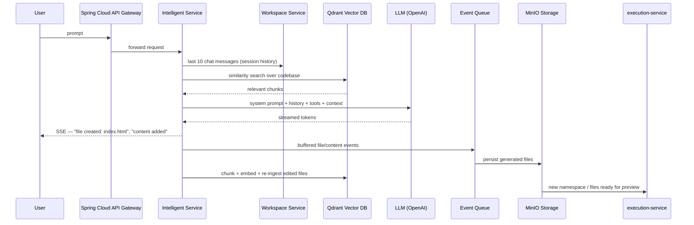
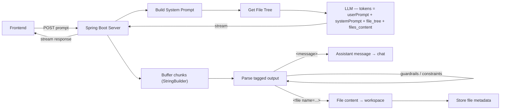
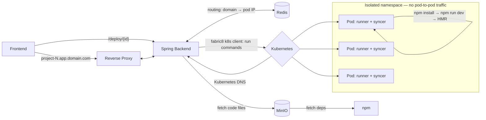

<div align="center">

# ⚡ Voltrix

### AI-Powered Website Builder — Describe it. Voltrix builds it.

Voltrix is a full-stack SaaS platform, inspired by Lovable.dev, that turns natural-language prompts into complete, working React applications — generated live, streamed token-by-token, and instantly previewable in an isolated Kubernetes sandbox.

[](https://openjdk.org/)
[](https://spring.io/projects/spring-boot)
[](https://spring.io/projects/spring-ai)
[](https://react.dev/)
[](https://www.typescriptlang.org/)
[](https://kubernetes.io/)
[](https://qdrant.tech/)
[](https://redis.io/)
[](https://min.io/)
[](https://stripe.com/)

[Backend Repo](https://github.com/Shashank07-debug/Voltrix-backend) · [Frontend Repo](https://github.com/Shashank07-debug/Voltrix-frontend) · [System Design](#-system-design) · [Getting Started](#-getting-started)

</div>

---

## 📖 Overview

A user types a prompt — *"update the color of the ProfileCard button to red"* — and Voltrix:

1. Retrieves the relevant slice of the codebase via **RAG over a vector DB**, not the whole project
2. Streams the model's response token-by-token over **SSE**
3. Parses a custom message/file protocol out of the stream in real time
4. Persists generated files to **object storage**
5. Hot-reloads a **live, isolated preview** running in its own Kubernetes namespace

Two repos make this up:

| Repo | Role |
|---|---|
| **[Voltrix-backend](https://github.com/Shashank07-debug/Voltrix-backend)** | Spring Boot services — gateway, AI generation, RAG, code execution, billing |
| **[Voltrix-frontend](https://github.com/Shashank07-debug/Voltrix-frontend)** | React + Vite + shadcn-ui client |

> **Status:** Core generation and preview pipeline functional. Frontend UI in active development.

---

## ✨ Features

### 🔐 Authentication & Authorization
- Stateless JWT auth (signup, login, `me` profile)
- Project-level roles (`OWNER`, `EDITOR`, `VIEWER`) via method security

### 📁 Projects, Files & Teams
- Full project CRUD, file tree + content retrieval
- Invite/manage collaborators per project

### 🤖 AI Generation Engine (RAG + Streaming)
- **Qdrant vector DB** stores the project's codebase as embeddings; each prompt runs a similarity search so the model only sees relevant context — not the entire repo
- New/edited files are chunked, embedded, and ingested back into Qdrant to keep the index current
- System prompt assembled from: user prompt + system prompt + file tree + relevant file contents
- Tool-calling support — `list_files`, `get_file_content(path)` — so the LLM can pull extra context on demand
- Response streamed over **Server-Sent Events**; chunks are buffered in a `StringBuilder` and parsed against a custom tagged protocol:

```xml
  <message>
  this will be the assistant message
  </message>

  <file name="src/App.tsx">
  import ... from "..."
  ...
  </file>
```
- Parsed output is checked against **guardrails/constraints** before being applied; `message` blocks stream to chat, `file` blocks stream to the workspace and object storage
- Circuit breaker around the LLM/tool calls for resilience

### ⚡ Live Preview / Code Execution
- Every project gets its own **isolated Kubernetes namespace**
- Each preview pod pairs a `runner` container (serves the Vite dev server) with a `syncer` sidecar that watches MinIO for file changes and applies them live
- **Network policy** blocks pod-to-pod communication — previews are fully isolated from each other
- A **reverse proxy** routes `project-{id}.app.domain.com` → the correct pod IP, resolved via **Redis** (`project-36.app.domain.com → 192.244.1.12:5173`)
- Dependencies are installed on-demand via `k8sClient.runCommand("npm install", podId, "runner")` (built on **fabric8** k8s client)
- Hot Module Reload keeps the preview live as files stream in

### 💳 Billing & Subscriptions
- Stripe Checkout, customer billing portal, webhook ingestion
- Plan listing + live subscription lookup

### 📊 Usage Tracking
- Daily token usage metering against plan limits, preview-run limits per plan

### 🛠 Engineering Quality
- Centralized API error shape, MapStruct mapping, auto-generated OpenAPI/Swagger docs

---

## 🧭 System Design

### 1. AI Generation Pipeline (RAG + Streaming)



### 2. Streaming Response Parser



### 3. Isolated Live Preview (Kubernetes)



**Key design notes**

- Each `runner` container serves the live Vite dev server for one project; the paired `syncer` watches MinIO and pushes file changes into the running container so HMR reflects generated code instantly.
- Routing is domain-based (`project-36.app.domain.com`, `project-37.app.domain.com`), resolved through Redis to the pod's cluster IP (e.g. `192.244.1.12:5173`), then handed to the reverse proxy.
- A strict **network policy** prevents any pod from reaching another — each user's live preview is fully sandboxed.
- The vector DB (Qdrant) doubles as the model's long-term memory of the codebase, keeping prompts small and generation accurate even as a project grows.

---

## 🧰 Tech Stack

<table>
<tr><td valign="top">

**Backend**
| Layer | Technology |
|---|---|
| Language | Java 21 |
| Framework | Spring Boot 4.0.0, Spring Cloud Gateway |
| Security | Spring Security 7, JWT (`jjwt`) |
| Data | Spring Data JPA + Hibernate |
| Database | PostgreSQL (`pgvector` image) |
| Vector search | Qdrant |
| AI | Spring AI 2.0.0-M1 + OpenAI |
| Object storage | MinIO (S3-compatible) |
| Cache / routing | Redis |
| Orchestration | Kubernetes + fabric8 client |
| Payments | Stripe Java SDK |
| Mapping | MapStruct |
| API docs | springdoc-openapi (Swagger UI) |
| Build | Maven |

</td><td valign="top">

**Frontend**
| Layer | Technology |
|---|---|
| Build tool | Vite |
| Language | TypeScript |
| Framework | React 18 |
| UI kit | shadcn-ui |
| Styling | Tailwind CSS |
| Package manager | npm / bun |

</td></tr>
</table>

---

## 🚀 Getting Started

### Prerequisites
- Java 21 & Maven (or the bundled `./mvnw`)
- Node.js & npm (or Bun)
- Docker (for local Postgres + MinIO)
- A Kubernetes cluster (for the live-preview/execution system) + `kubeconfig`
- Redis instance
- OpenAI API key, Stripe API keys

### 1. Clone both repos

```bash
git clone https://github.com/Shashank07-debug/Voltrix-backend.git
git clone https://github.com/Shashank07-debug/Voltrix-frontend.git
```

### 2. Start local infrastructure (backend)

```bash
cd Voltrix-backend
docker compose -f services.docker-compose.yml up -d
```

This starts:
- **PostgreSQL** (`pgvector` image) → `localhost:9010` (maps to container port `5432`)
- **MinIO** → `localhost:9000` (S3 API), `localhost:9001` (web console)

### 3. Configure the backend

`src/main/resources/application.properties` is git-ignored. Create it with your DB, MinIO, Redis, Qdrant, Kubernetes, Stripe, and OpenAI credentials, then run:

```bash
./mvnw spring-boot:run
```

The API starts on **`http://localhost:8082`**.

- Swagger UI → `http://localhost:8082/swagger-ui.html`
- OpenAPI JSON → `http://localhost:8082/v3/api-docs`

### 4. Run the frontend

```bash
cd Voltrix-frontend
npm install
npm run dev
```

Point the frontend's API base URL at `http://localhost:8082` and you're generating apps.

---

## 📡 API Overview

| Area | Base path | Notes |
|---|---|---|
| Auth | `/api/auth/**` | signup, login, profile — public |
| Projects | `/api/projects/**` | CRUD |
| Project files | `/api/projects/{projectId}/files/**` | file tree & content |
| Project members | `/api/projects/{projectId}/members/**` | invite/manage collaborators |
| Chat / generation | `/api/chat/stream`, `/api/chat/projects/{projectId}` | SSE-streamed AI code generation |
| Billing | `/api/plans`, `/api/me/subscription`, `/api/payments/**` | Stripe checkout & portal |
| Webhooks | `/webhooks/**` | Stripe event ingestion — public |
| Usage | `/api/usage/**` | daily usage & plan limits |

All routes other than `/api/auth/**`, `/webhooks/**`, and the Swagger/OpenAPI endpoints require a valid JWT.

---

## 📂 Project Structure

**Backend**
```
Voltrix-backend/
├── config/         # AI, payment, storage, and k8s client bean configuration
├── controller/     # REST controllers
├── dto/            # Request/response DTOs, grouped by domain
├── entity/         # JPA entities
├── enums/          # Domain enums
├── error/          # Global exception handling
├── llm/            # LLM prompt/response handling, RAG, and code-gen tools
├── mapper/         # MapStruct mappers
├── repository/     # Spring Data JPA repositories
├── security/       # JWT auth filter, security config
└── service/        # Business logic (+ impl/ for implementations)
```

**Frontend**
```
Voltrix-frontend/
├── public/          # Static assets
├── src/             # Application source (components, pages, hooks)
├── components.json  # shadcn-ui configuration
├── tailwind.config.ts
└── vite.config.ts
```

---

## 🗺️ Roadmap

- [ ] Polish Voltrix's own builder dashboard/chat UI
- [ ] Deployment & CI/CD pipeline
- [ ] Automated test coverage (backend + frontend)
- [ ] Expand guardrail/constraint rules for generated output

---

## 🤝 Contributing

Issues and pull requests are welcome on either repo — [backend](https://github.com/Shashank07-debug/Voltrix-backend) or [frontend](https://github.com/Shashank07-debug/Voltrix-frontend).

## 📄 License

Not yet specified.

---

<div align="center">
Built by <a href="https://github.com/Shashank07-debug">Shashank07-debug</a>
</div>
